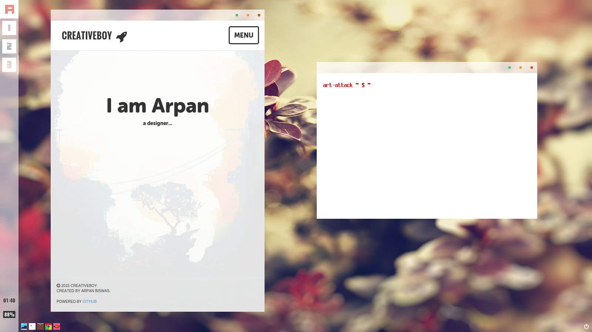
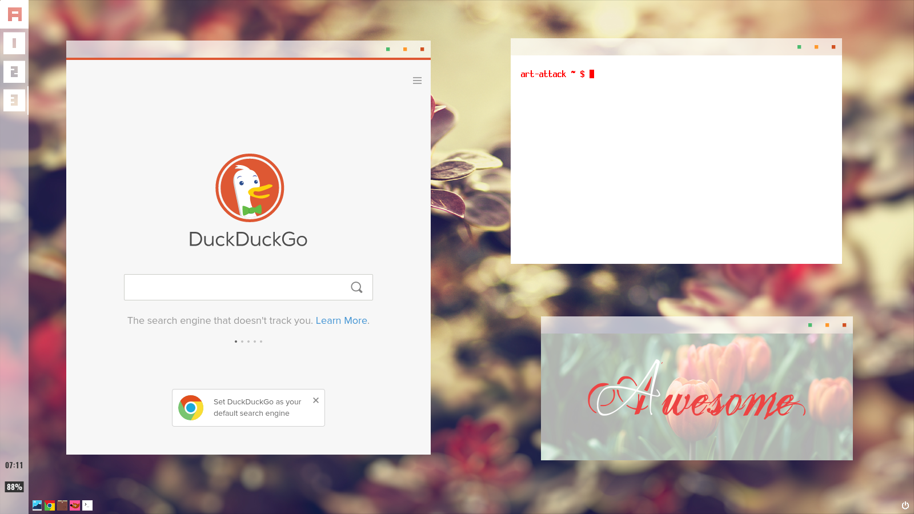

**Themes for Awesome_WM_ 3.5**

:Author: Arpan Biswas
:License: BY-NC-SA_

TODO
==========

Just copy all the files and folders to your ~/.config/awesome directory and done.

*use git:*

 # git clone https://github.com/talk2william/awesome-trans.git
 
 # cp -rf awesome-trans/* ~/.config/awesome/
 
*or download the zip_ and extract it inside the ~/.config/awesome directory.*

*for best optimization you must need this all:*

- *compton_ (shadding/effects)*

- *rxvt (terminal) if you want to use my* Xresources_

- *scrot (take screenshot)*

**USAGE**

- Touch top-left corner to toggle navbar.

- Use alt + up/down arrow to increase/decrease volume.

- Press print_scrn key to take a screenshot.

**NOTE**

This theme uses oswald_ font so, you need to install it.

You may want to change few icons individually that you don't like.. so,here i provide you my *tasklist.lua* as sample_
look at the comment line *Set custom icons*

    if c.class == "class_name" then
      local icon = gears.surface("/path/to/icon.png")
      return text, bg, bg_image, icon
    end

use xprop to know the client class name.

The Best way to utilize it is to copy the file into user's awesome directory and then edit it:
 # cp -rf /usr/share/awesome/lib/awful/widget/tasklist.lua ~/.config/awesome/

SNAPSHOTS
===========

.. _BY-NC-SA: http://creativecommons.org/licenses/by-nc-sa/3.0/
.. _compton: https://github.com/chjj/compton
.. _zip: https://github.com/talk2william/awesome-trans/archive/master.zip
.. _sample: /tasklist.lua
.. _Xresources: /.Xresources
.. _oswald: /oswald.ttf
